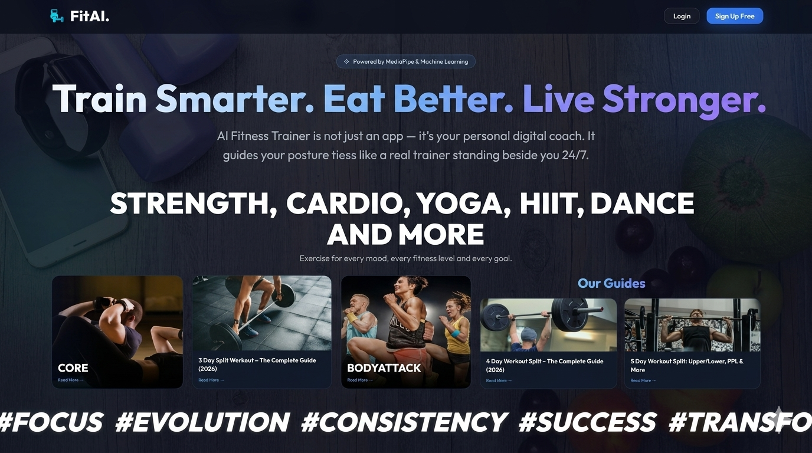

# AI Fitness Trainer

A modern, full-stack AI fitness application that combines a multi-layered neural network recommendation engine, real-time pose tracking, Retrieval-Augmented Generation (RAG), and live API integrations to provide truly adaptive, personalised workout and diet plans.
<p align="center">
  
</p>

<h1 align="center">🏋️ AI Fitness Trainer</h1>

<p align="center">
An intelligent full-stack fitness platform powered by Artificial Intelligence, Deep Learning, Computer Vision, and Retrieval-Augmented Generation (RAG).
</p>

<p align="center">
  
  
  
  
  
  
</p>

---

## Setup Instructions

### 1. Backend Setup

Open a terminal in the `backend` directory:

```bash
cd backend
```

Create a virtual environment (optional but recommended):
```bash
python -m venv venv
venv\Scripts\activate  # On Windows
```

Install dependencies:
```bash
pip install -r requirements.txt
```

Create a `.env` file in the `backend/` folder with your API keys:
```env
GEMINI_API_KEY=your_google_gemini_api_key
EDAMAM_APP_ID=your_edamam_app_id
EDAMAM_APP_KEY=your_edamam_app_key
```

> **Note:** The app works without Edamam keys (falls back to Gemini for diet), and works without Gemini (falls back to the local PyTorch model for workouts). Only `GEMINI_API_KEY` is required for full AI features.

Seed the database with demo data:
```bash
python seed.py
```

Run the FastAPI server:
```bash
python -m uvicorn main:app --reload
```
The API will be available at `http://127.0.0.1:8000`. Swagger docs at `http://127.0.0.1:8000/docs`.

### 2. Frontend Setup

Open a new terminal in the `frontend` directory and serve it:
```bash
cd frontend
python -m http.server 3000
```
Then navigate to `http://localhost:3000/index.html` in your browser.

## Getting API Keys

### Google Gemini (Free)
1. Go to [Google AI Studio](https://aistudio.google.com/)
2. Sign in with your Google account
3. Click **"Get API key"** → **"Create API key"**
4. Copy and paste into your `.env` as `GEMINI_API_KEY`

### Edamam Recipe API (Free Developer Tier)
1. Go to [Edamam Developer Portal](https://developer.edamam.com/edamam-recipe-api)
2. Sign up for a free account
3. Create an application under the **Recipe Search API** (free tier)
4. Copy the **Application ID** and **Application Key** into your `.env`

## Using the Demo Data

When you run `python seed.py`, it generates 50 synthetic users for ML training, plus a demo user:
- **Username**: `demo_student`
- **Password**: `password123`

Log in with these credentials to immediately see a populated dashboard with historical workout data, charts, and a pre-populated weekly planner!

## Exercises Supported (Live AI Coach)

The Live AI Coach supports the following exercises using real-time joint angle tracking via MediaPipe:

1. **Squats** — Tracks knee angle; warns if knees cave in.
2. **Lunges** — Tracks front knee angle for depth and form.
3. **Plank** — Timed hold with live alignment tracking; warns for hip drop or hip pike.
4. **Shoulder Press** — Tracks elbow angle for full extension.
5. **Push-ups** — Tracks shoulder-elbow-wrist angle for depth and lockout.

---
# 🚀 What Makes This Project Unique?

Unlike traditional fitness applications that rely on static workout templates, AI Fitness Trainer uses a layered AI architecture:

- Retrieval-Augmented Generation (RAG) ensures recommendations remain grounded in curated exercise knowledge.
- A custom PyTorch Seq2Seq model acts as a local AI fallback system.
- Database-level API caching minimizes token usage and improves scalability.
- MediaPipe enables real-time computer vision-based coaching directly in the browser.
- Machine Learning models predict personalized Fitness Scores using historical user data.

This creates a resilient, production-inspired AI system rather than a simple CRUD-based fitness tracker.

---
